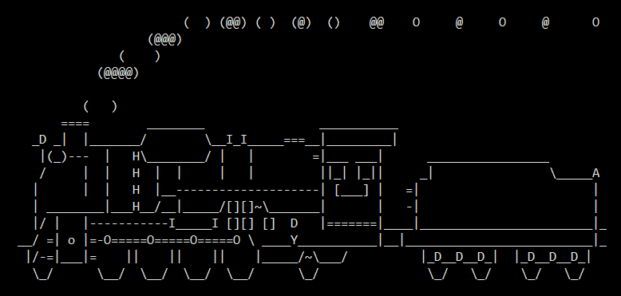
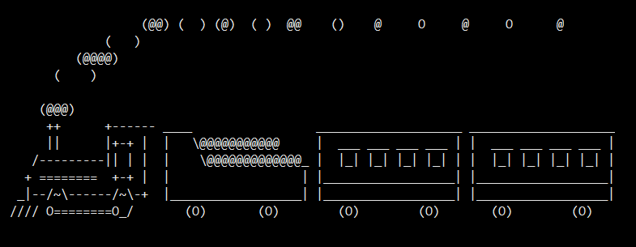

# 软件管理

* 软件运行环境
* 软件包基础
* rpm包管理
* yum管理
* 定制yum仓库
* 编译安装

## 软件运行环境


### EPEL源

用`sl`命令跑个火车看看


用`sl -l`命令跑个小火车



### 关闭并禁用防火墙
```bash
[root@centos7 ~]# systemctl status firewalld.service 
● firewalld.service - firewalld - dynamic firewall daemon
   Loaded: loaded (/usr/lib/systemd/system/firewalld.service; enabled; vendor preset: enabled)
   Active: active (running) since Fri 2019-03-22 11:09:31 CST; 3h 10min ago
     Docs: man:firewalld(1)
 Main PID: 6324 (firewalld)
    Tasks: 2
   CGroup: /system.slice/firewalld.service
           └─6324 /usr/bin/python -Es /usr/sbin/firewalld --nofork --nopid

Mar 22 11:09:30 centos7.localdomain systemd[1]: Starting firewalld - dynamic ....
Mar 22 11:09:31 centos7.localdomain systemd[1]: Started firewalld - dynamic f....
Hint: Some lines were ellipsized, use -l to show in full.
[root@centos7 ~]# systemctl stop firewalld.service 
[root@centos7 ~]# systemctl disable firewalld.service 
Removed symlink /etc/systemd/system/multi-user.target.wants/firewalld.service.
Removed symlink /etc/systemd/system/dbus-org.fedoraproject.FirewallD1.service.
[root@centos7 ~]#
```