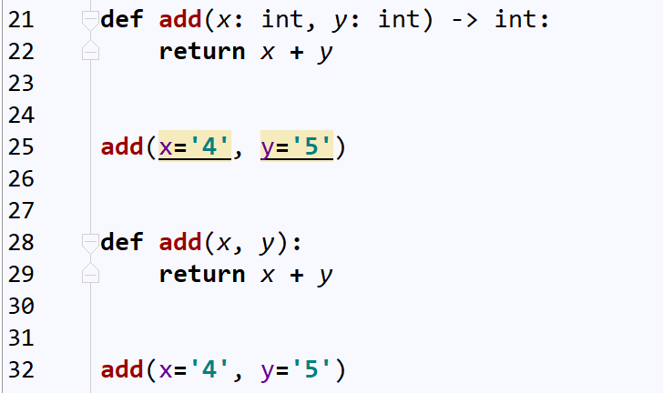

**14 - 函数参数检测-inspect模块**

---

[TOC]

---

# 1. python 类型注解
&emsp;&emsp;类型注解，即对变量的类型，进行标注或者说明，因为 Python 是一门动态编译型语言，我们无法在赋值时就定义它的变量类型，所以在 `Python3.5` 以上版本新增了类型注解，但仅仅是提示作用，并不能严格控制，这是动态编译型语言的通病，下面来仔细看一下什么是 Python 的类型注解。

# 2. 函数定义的弊端
&emsp;&emsp;Python 是动态语言，变量随时可以被赋值，且赋值为不同的类型，这就与静态语言不同了，变量的类型是在运行期决定的，而静态语言事先就已经定义好了变量的类型了。这是动态语言方便之处，但也是一种弊端，我们无法控制变量的类型，也就无法控制异常的产生。举个栗子

```python
def add(x,y):
    return x + y 
print(add(1,2))
print(add('s','b'))
print(add(1,'a'))

```

&emsp;&emsp; 当用户传入两个数字时，返回它们的和，但是如果我们传递其他变量呢？比如字符串，因为 Python 中实现了 + 号的类型重载，所以说两个字符串的确可以加，但是如果是数字和字符串呢？在 Python 这种强类型语言中来说，属于非法操作(javascript 会隐式转换)，而这时，我们就需要对用户传入的数据进行类型判断，不符合本函数的需求，那么就抛个异常，或者提示等等操作，这样就不会引起后续代码在执行期崩溃。如何解决呢？其实主要有两种方式。
- 函数文档
- 函数注解

# 3. 函数文档
&emsp;&emsp; 在函数中插入说明性文档的方式成为函数文档。

```python
def add(x, y):
    """
    This function used to add something
    :param x: int object
    :param y: int object
    :return: int object
    """
    return x + y
```

&emsp;&emsp;在函数中，一般是定义语句后的首行使用三对双引号表示。通常存储在函数的__doc__属性中。当用户使用 help(函数) 时，会被打印在屏幕上。

```python
In : def add(x, y):
...:     """
...:     This function used to add something
...:     :param x: int object
...:     :param y: int object
...:     :return: int object
...:     """
...:     return x + y
...:

In : help(add)
Help on function add in module __main__:

add(x, y)
    This function used to add something
    :param x: int object
    :param y: int object
    :return: int object

In : print(add.__doc__)

    This function used to add something
    :param x: int object
    :param y: int object
    :return: int object

```

> &emsp;&emsp;每次都要使用 help 来查看函数的说明，的确可以让使用者了解函数的参数以及返回值的类型，但并不是所有人都愿意写 doc 的，在这个所谓的敏捷开发时代，人们大多会以敏捷开发为借口没时间写，所以这种方法不是很常用。  

# 4. 函数注解
&emsp;&emsp;Python 的函数注解是什么呢？首先来看一下如下代码：

```python
def add(x: int, y: int) -> int:
    return x + y

```

- 函数的位置形参，和默认值形参后使用冒号分隔，后面用于标识变量期望的类型。
- 在 def 语句末尾，使用 -> 符号后 指定用于标识函数执行后的返回值类型。  
完成以上定义后，，主要的差别如下图：  
  

> &emsp;&emsp;当我们在 IDE 中准备传入非注释类型变量时，IDE 会帮我们进行颜色提示，用于表示这里传入的变量有点问题。在编写时我们尚且可以使用这种方式，对我们产生一点 ' 警示 '，但是当我们写的函数被其他人调用的时候，那么就无法进行 ' 提示 ' 了，这个时候，我们就需要对传入的参数进行类型检查了。    

我们来总结一下：
- 函数注解在 Python3.5 中引入
- 对函数的参数、返回值进行类型注解
- 只对函数的参数做一个辅助的说明，并不对函数参数进行类型检查
- 提供给第三方工具，做代码分析，发现隐藏的 BUG
- 函数注解的信息，保存在函数的 `__annotation__` 属性中。

> `python3.6` 以上还添加了变量的注解：`i:int = 10`, 当然也只是提示的作用。    

## 4.1. annotation 属性
在 Python 中使用 `__` 开头的表示符一般被用特殊属性，`__annotation__` 存储的就是函数的签名信息

```python
In : def add(x: int, y: int) -> int:
...:     return x + y
...:

In : add.__annotations__
Out: {'x': int, 'y': int, 'return': int}

```

&emsp;&emsp; 当我们使用变量注释时，变量名和类型就会存放在函数的`__annotations__`属性中。那么即然有变量存储，那么我们是不是只需要获取传入的参数，然后和 annotations 中存储的变量类型进行比较是不是就达到目的了呢？仔细思考一下：
1. 参数检查势必要在函数执行前，想要在 add 执行前添加参数判断那么就需要使用装饰器了
2. `__annotations__`的值是一个字典，字典是无序的，用户按照位置传进来参数是有序的，如何让它们形成对应关系方便我们检测呢？  
下面我们来了解一下 inspect 模块，它可以帮我们完成这个事情。

# 5. inspect 模块
&emsp;&emsp; 官方解释如下：inspect 模块提供了几个有用的函数来帮助获取关于活动对象的信息，例如模块、类、方法、函数、回溯、框架对象和代码对象。例如，它可以帮助您检查类的内容、检索方法的源代码、提取并格式化函数的参数列表，或者获取显示详细回溯所需的所有信息。

## 5.1. 常用方法

| 分类 | 方法名称 | 功能 |
| :--|:--|:-- |
判断 |`inspect.getmodulename(path)`| 获取模块名称 |
| | `inspect.ismodule(object)`| 是不是个模块 |
| | `inspect.isclass(object)`| 是不是个类 |
| | `inspect.ismethod(object)`| 是不是一个方法 |
| | `inspect.isfunction(object)`| 是不是一个函数 |
| | `inspect.isgeneratorfunction(object)`| 是不是一个生成器函数 |
| | `inspect.isgenerator(object)`| 是不是一个生成器 |
| | `inspect.iscoroutinefunction(object)`| 是不是一个协程函数 |
| 获取信息 |`inspect.getmodulename(path)`| 获取模块名称 |
| |`inspect.getsource(object)`| 获取对象的原码(并不会解析装饰器原码) |

## 5.2. signature 类
&emsp;&emsp; 首先我们要说的是函数的签名信息：它包含了了函数的函数名、它的参数类型，它所在的类和名称空间及其他信息，签名对象(signature object) 表示可调用对象的调用签名信息和它的注解信息，当我们使用 `signature()` 时，它会重新返回一个包含可调用对象信息的签名对象。

## 5.3. parameters 属性
&emsp;&emsp;signature 类的 `parameters` 属性，它里面存放的是函数的参数注解和返回值注解，组成的有序字典，其中参数注解的格式为：参数名称，使用 `inspect.Parameters` 类包装的参数注解，这个参数注解很强大，它包含如下常用的方法：

| 方法名称 | 含义 |
| :--|:-- |
| empty | 等同于 inspect._empty 表示一个参数没有被类型注释 |
| name | 参数的名称 |
| default | 参数的默认值，如果一个参数没有默认值，这个属性的值为 | inspect.empty |
| annotation | 参数的注解类型，如果参数没有定义注解，这个属性的值为 | inspect.empty |
| kind | 参数的类型   |

&emsp;&emsp;这里的参数类型表示的是 inspect 内置参数类型(其实就是几个常用的函数参数定义类型而已，只是换个名字而已)

```python
_POSITIONAL_ONLY       = _ParameterKind.POSITIONAL_ONLY       # 位置参数_only
_POSITIONAL_OR_KEYWORD = _ParameterKind.POSITIONAL_OR_KEYWORD # 位置或关键字参数
_VAR_POSITIONAL        = _ParameterKind.VAR_POSITIONAL        # 可变位置参数
_KEYWORD_ONLY          = _ParameterKind.KEYWORD_ONLY          # keyword-only 
_VAR_KEYWORD           = _ParameterKind.VAR_KEYWORD           # 可变关键字参数

```

> 其中 POSITIONAL_ONLY，Python 中没有被实现。    

## 5.4. 获取对象的参数签名
根据上面讲的方法，我们可以通过如下方式，简单的获取参数的签名：

```python
In : import inspect
...:
...: def add(x: int, y: int) -> int:
...:     return x + y
...:
...: sig = inspect.signature(add)
...: params = sig.parameters
...: print(params)
OrderedDict([('x', <Parameter "x:int">), ('y', <Parameter "y:int">)])

In : params['x'].annotation
Out: int    # 如果没有定义 x 的参数注解，那么这里就是 inspect._empty

```


通过它的属性，搭配 **有序字典** 这个特性，有没有很兴奋？参数有序，传入的实参有序，还能获取参数注解的类型，那么就可以开工进行参数检查了！

# 6. 检查参数
以上面函数为例子，当给 add 函数传入的 x，y 时进行参数检查，如果 x，y 不是 int 类型，那么返回异常，并退出函数

```python

import inspect
import functools

def check(fn):
    @functools.wraps(fn)   # 等于 wrapper.__annotation__ = fn.__annotation__ 还有其他的属性比如__doc__，__module__等
    def wrapper(*args, **kwargs):
        sig = inspect.signature(fn)   # 获取 add 函数签名信息
        params = sig.parameters     # 获取 add 函数的参数信息
        values = list(params.values())   # 由于 params 是个有序字典，那么 values 也是有序的，只需根据索一一对应判断即可
        for i, k in enumerate(args):   # 遍历用户传入的位置参数
            if values[i].annotation != inspect._empty:   # 如果定义了参数注解，则开始检查
                if not isinstance(k, values[i].annotation):   # 如果检查不通过，抛出异常
                    raise Exception('args Key Error')
        for k,v in kwargs.items():
            if params[k].annotation != inspect._empty:
                if not isinstance(v,params[k].annotation):
                    raise Exception('kwargs Key Error')
        return fn(*args, **kwargs)
    return wrapper

@check
def add(x: int, y: int) -> int:
    return x + y  
add(4,y=5)

```

