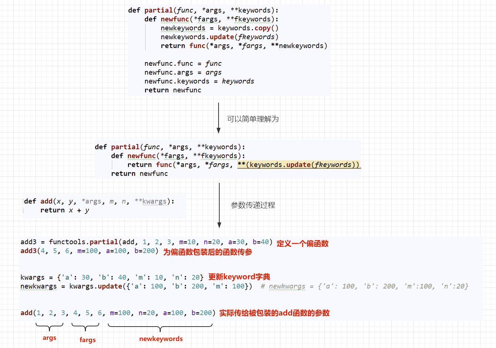

**15 - reduce-pratial偏函数-lru_cache**

---

[TOC]

---

# 1. 介绍
&emsp;&emsp;functools 模块存放着很多工具函数，大部分都是高阶函数，其作用于或返回其他函数的函数。一般来说，对于这个模块，任何可调用的对象都可以被视为函数。

# 2. reduce 方法
&emsp;&emsp; 其含义是减少，它接受一个两个参数的函数，初始时从可迭代对象中取两个元素交给函数，下一次会将本次函数返回值和下一个元素传入函数进行计算，直到将可迭代对象减少为一个值，然后返回：`reduce(lambda x, y: x+y, [1, 2, 3, 4, 5]) calculates((((1+2)+3)+4)+5)`,

```python
reduce(function, sequence[, initial]) -> value

```

- function: 两个参数的函数
- sequence：可迭代对象(不能为空)
- initital：初始值(可以理解为给函数的第一个参数指定默认值)，否则第一次会在可迭代对象中再取一个元素  
下面是一个求 1 到 100 累加的栗子

```python
# 普通版
In : sum = 0
In : for i in range(1,101):
...:     sum += i
...:
In : print(sum)
5050

# 利用 reduce 版
In : import functools
In : functools.reduce(lambda x,y:x+y,range(101))
Out: 5050

```

# 3. partial 方法(偏函数)
&emsp;&emsp; 在前面学习函数参数的时候，通过设定参数的默认值，可以降低函数调用的难度。而偏函数也可以做到这一点，funtools 模块中的 partial 方法就是将函数的 ** 部分参数固定下来 **，相当于为部分的参数添加了一个固定的默认值，形成一个 ** 新的函数并返回 **。从 partial 方法返回的函数，是对原函数的封装，是一个全新的函数。

> 注意：这里的偏函数和数学意义上的偏函数不一样。  

```python
partial(func, *args, **keywords) - 返回一个新的被 partial 函数包装过的 func，并带有默认值的新函数

```

## 3.1. partial 方法基本使用

```python
In : import functools
...: import inspect
...:
...:
...: def add(x, y):
...:     return x + y
...:
...:
...: new_add = functools.partial(add,1)
...: print(new_add)
...:
functools.partial(<function add at 0x000002798C757840>, 1)

In :
In : new_add(1,2)
---------------------------------------------------------------------------
TypeError                                 Traceback(most recent call last)
<ipython-input-28-2d6520b7602a> in <module>
----> 1 new_add(1,2)

TypeError: add() takes 2 positional arguments but 3 were given

In : new_add(1)
Out: 2

```

- 由于我们包装了函数 add，并指定了一个默认参数 1，这个参数会按照位置参数，当作默认值赋给 x 了
- 所以当我们再次调用 new_add, 只需要传入 y 的值就行了。
- 如果再传递两个，那么连同包装前传入的 1，一起传给 add 函数，而 add 函数只接受两个参数，所以会报异常。

> 获取一个函数的参数列表，可以使用前面学习的 inspect 模块  

```python
In : inspect.signature(new_add)
Out: <Signature(y)>

```

- 查看 new_add 的签名信息，发现，它的确只需要传入一个 y 就可以了。  
根据前面我们所学的函数知识，我们知道函数传参的方式有很多种，利用偏函数包装后产生的新函数的传参会有所不同，下面会列举不同传参方式被偏函数包装后的签名信息。

```python
# 最复杂的函数的形参定义方式
def add(x, y, *args, m, n, **kwargs):
    return x + y

```

- add1 =`functools.partial(add,x=1)`：包装后的签名信息(*, x=1, y, m, n, **kwargs)，只接受 keyword-only 的方式赋值了
- add2 = `functools.partial(add,1,y=20)`：包装后的签名信息(*, y=20, m, n, **kwargs)，1 已经被包装给 x 了其他参数只接受 keyword-only 的方式赋值了
- add3 = `functools.partial(add,1,2,3,m=10,n=20,a=30,b=40)`：包装后的签名信息(*args, m=10, n=20, **kwargs),1 给了 x，2 给了 y， 3 给了 args，可以直接调用 add3，而不用传递任何参数
- add4 = `functools.partial(add,m=10,n=20,a='10')`：包装后的签名信息(x, y, *args, m=10, n=20, **kwargs),a='10' 已被 kwargs 收集，依旧可以使用位置加关键字传递实参。

## 3.2. partial 原码分析
上面我们已经了解了 partial 的基本使用，下面我们来学习一下 partial 的原码，看它到底是怎么实现的，partial 的原码存在于 documentation 中，下面是原码：

```python
def partial(func, *args, **keywords):
    def newfunc(*fargs, **fkeywords):
        newkeywords = keywords.copy()    # 偏函数包装时指定的位置参数进行拷贝
        newkeywords.update(fkeywords)    # 将包装完后，传递给偏函数的关键字参数更新到 keyword 字典中去（key 相同的被替换）
        return func(*args, *fargs, **newkeywords)  # 把偏函数包装的位置参数优先传递给被包装函数，然后是偏函数的位置参数，然后是关键字参数
    newfunc.func = func    # 新增函数属性，将被包装的函数绑定在了偏函数上，可以直接通过偏函数的 func 属性来调用原函数
    newfunc.args = args    # 记录包装指定的位置参数
    newfunc.keywords = keywords # 记录包装指定的关键字参数
    return newfunc

```

上面是偏函数的原码注释，如果不是很理解，请看下图


## 3.3. functools.warps 实现分析
现在我们在来看一下 functools.warps 函数的原码实现，前面我们已经说明了，它是用来拷贝函数签名信息的装饰器，它在内部是使用了偏函数实现的。

```python
def wraps(wrapped,
          assigned = WRAPPER_ASSIGNMENTS,
          updated = WRAPPER_UPDATES):

    return partial(update_wrapper, wrapped=wrapped,
                   assigned=assigned, updated=updated)  

```

使用偏函数包装了 update_wrapper 函数，并设置了下面参数的默认值：
- wrapped=wrapped：将传入给 wraps 的函数，使用偏函数，当作 update_wrapper 的默认值。
- assigned=assigned：要拷贝的信息 `'__module__', '__name__', '__qualname__', '__doc__','__annotations__'`
- updated=updated: 这里使用的是 `'__dict__'`, 用来拷贝函数的属性信息

> __dict__是用来存储对象属性的一个字典，其键为属性名，值为属性的值    

下面来看一下 update_wrapper 函数，因为真正执行的就是它:

```python
def update_wrapper(wrapper,
                   wrapped,
                   assigned = WRAPPER_ASSIGNMENTS,
                   updated = WRAPPER_UPDATES):
    for attr in assigned:
        try:
            value = getattr(wrapped, attr)
        except AttributeError:
            pass
        else:
            setattr(wrapper, attr, value)
    for attr in updated:
        getattr(wrapper, attr).update(getattr(wrapped, attr, {}))
    wrapper.__wrapped__ = wrapped   # 将被包装的函数，绑定在__wrapped__属性上。
    return wrapper

```

- update_wrapper 在外层被 wraps 包装，实际上只需要传入 wrapper 即可
- 后面的代码可以理解为是通过反射获取 wrapped 的属性值，然后 update 到 wrapper 中(拷贝属性的过程)
- 最后返回包装好的函数 wrapper  
update_wrapper 返回的就是我们的 wrapper 对象，所以如果不想用 wraps，我们可以直接使用 update_wrapper

```python
import time
import datetime
import functools

def logger(fn):
    # @functools.wraps(fn)  # wrapper = functools.wraps(fn)(wrapper)
    def wrapper(*args, **kwargs):
        start = datetime.datetime.now()
        res = fn(*args, **kwargs)
        duration = (datetime.datetime.now() - start).total_seconds()
        print(' 函数：{} 执行用时：{}'.format(wrapper.__name__,duration))
        return res

    wrapper = functools.update_wrapper(wrapper, fn)  # 这里进行调用，但是很难看有木有？
    return wrapper

@logger
def add(x, y):
    time.sleep(2)
    return x + y

add(4,5)

```

> 这里之所以使用偏函数实现，是因为对于拷贝这个过程来说，要拷贝的属性一般是不会改变的，那么针对这些不长改变的东西进行偏函数包装，那么在使用起来会非常方便，我觉得这就是偏函数的精髓吧。    

结合前面参数检查的例子，来加深 functools.wraps 的实现过程理解。

```python
import inspect
import functools

def check(fn):
    @functools.wraps(fn) 
    def wrapper(*args, **kwargs):
        params = inspect.signature(fn).parameters  
        values = list(params.values()) 
        for i, k in enumerate(args): 
            if values[i].annotation != inspect._empty: 
                if not isinstance(k, values[i].annotation): 
                    raise Exception('args Key Error')
        for k, v in kwargs.items():
            if params[k].annotation != inspect._empty:
                if not isinstance(v, params[k].annotation):
                    raise Exception('kwargs Key Error')
        return fn(*args, **kwargs)
    return wrapper

```

-`@functools.wraps(fn)`表示一个有参装饰器，在这里实际上等于：`wrapper = functools.wraps(fn)(wrapper)`-`functools.wraps(fn)`的返回值就是偏函数`update_wrapper`, 所以也可以理解为这里实际上：`update_wrapper(wrapper)`-`update_wrapper` 在这里将 wrapped 的属性(也就是 fn)，拷贝到了 wrapper 上，并返回了 wrapper。  
经过上述数说明 `@functools.wraps(fn)` 就等价于 `wrapper = update_wrapper(wrapper)`，那么再来看拷贝的过程，就很好理解了。

# 4. lru_cache 方法
&emsp;&emsp;Least-recently-used 装饰器。 lru，最近最少使用。 cache 缓存  
&emsp;&emsp; 学习 lru_cache 方法，那么不得不提 cache，那什么是 cache 呢？我们说数据是存放在磁盘上的，CPU 如果需要提取数据那么需要从磁盘上拿，磁盘速度很慢，直接拿的话，就很耗时间，所以操作系统会把一些数据提前存储到内存中，当 CPU 需要时，直接从内存中读取即可，但是内存毕竟是有限的，不是所有空间都用来存这些数据，所以内存中的一小部分用来存储磁盘上读写频繁的数据的空间，就可以简单的理解为 cache(这里就不提 CPU 的 L1,L2,L3 cache 了).  
&emsp;&emsp;lru_cache 方法简单来说，就是当执行某一个函数时，把它的计算结果缓存到 cache 中，当下次调用时，就直接从缓存中拿就可以了，不用再次进行计算。这种特性对于那种计算非常耗时的场景时非常友好的。  

> 把函数的计算结果缓存，需要的时候直接调用，这种模式该如何实现呢？简单来讲就是通过一个东西来获取它对应的值，是不是和字典的元素很像？通过一个 key 获取它对应的 value！实际上大多数缓存软件都是这种 key-value 结构！！！    

## 4.1. 基本使用
它作为装饰器作用于需要缓存的函数，用法格式如下：

```python
functools.lru_cache(maxsize=128, typed=False)

```

-`maxsize`: 限制不同参数和结果缓存的总量，如果设置为`None`，则` 禁用 LRU 功能 `，并且缓存可以无限制增长，当 maxsize 是二的幂时，LRU 功能执行的最好，当超过 maxsize 设置的总数量时，LRU 会把最近最少用的缓存弹出的。
- `typed`: 如果设置为 True，则不同类型的函数参数将单独缓存，例如 f(3) 和 f(3.0) 将被视为具有不同结果的不同调用

> 使用 `被装饰的函数.cache_info()` 来查看缓存命中的次数，以及结果缓存的数量。  

```python
In : import functools

In : @functools.lru_cache()
...: def add(x: int, y: int) -> int:
...:     time.sleep(2)
...:     return x + y
...:

In : import time

In : add.cache_info()   # 没有执行，没有缓存，也就没有命中了
Out: CacheInfo(hits=0, misses=0, maxsize=128, currsize=0)

In : add(4,5)           # 执行一次，缓存中不存在，所以 miss1 次，本次结果将会被缓存
Out: 9

In : add.cache_info()   # 验证缓存信息，currsize 表示当前缓存 1 个，misses 表示错过 1 次
Out: CacheInfo(hits=0, misses=1, maxsize=128, currsize=1)

In : add(4,5)          # 本次执行速度很快，因为读取的是缓存，被命中一次，所以瞬间返回
Out: 9

In : add.cache_info()  # 命中加 1 次
Out: CacheInfo(hits=1, misses=1, maxsize=128, currsize=1)

```

cache_info 各参数含义：
- hits: 缓存命中次数。当次传入计算的参数，如果在缓存中存在，则表示命中
- misses: 未命中次数。当次传入计算的参数，如果在缓存中存在，则表示未命中
- maxsize：表示缓存的 key 最大数量
- currsize：已经缓存的 key 的数量

## 4.2. lru_cache 原码分析

```python

def lru_cache(maxsize=128, typed=False):
    if maxsize is not None and not isinstance(maxsize, int):
        raise TypeError('Expected maxsize to be an integer or None')

    def decorating_function(user_function):
        wrapper = _lru_cache_wrapper(user_function, maxsize, typed, _CacheInfo)
        return update_wrapper(wrapper, user_function)

    return decorating_function

```

&emsp;&emsp; 这里的返回的`decorating_function`函数中返回的`update_wrapper`是不是看起来很熟悉，没错，这里同样利用了偏函数对被包装函数的属性签名信息进行了拷贝，而传入的 wrapper 是才是缓存的结果，所以我们进一步查看_lru_cache_wrapper 到底是怎么完成缓存的。

```python
def _lru_cache_wrapper(user_function, maxsize, typed, _CacheInfo):
    ... ...

    cache = {}
    hits = misses = 0
    full = False

    ... ...

    def wrapper(*args, **kwds):
        # Size limited caching that tracks accesses by recency
        nonlocal root, hits, misses, full
        key = make_key(args, kwds, typed)
        with lock:  
    ... ...

```

&emsp;&emsp; 这里截取部分代码进行简要说明：cache 是个字典，那么就印证了之前我们的设想，的确是使用字典 key-value 的形式进行缓存的。字典的 key 是来自于 make_key 函数的，那么我们接下来看一看这个函数都做了哪些事

```python
def _make_key(args, kwds, typed,
             kwd_mark = (object(),),
             fasttypes = {int, str, frozenset, type(None)},
             tuple=tuple, type=type, len=len):
    key = args
    if kwds:     # 在使用关键字传参时，遍历 kwds
        key += kwd_mark  # 使用一个特殊的对象 obkect() 来 作为位置传参和关键字传参的 ' 分隔符 '
        for item in kwds.items():
            key += item
    if typed:
        key += tuple(type(v) for v in args)
        if kwds:
            key += tuple(type(v) for v in kwds.values())
    elif len(key) == 1 and type(key[0]) in fasttypes:
        return key[0]
    return _HashedSeq(key)

```

- args: 是我们给函数进行的位置传参，这里是元组类型（因为不希望被修改）。
- kwargs: 关键字传参的字典。
- _HashedSeq: 可以理解为对 hash() 函数的封装，仅仅是计算构建好的 key 的 hash 值，并将这个值作为 key 进行存储的。> 注意，这里的函数  `_make_key` 是以 `_` 开头的函数，目的仅仅是告诉你，这是私有函数，不要擅自使用，但是为了学习 cache 的 key 是怎么生成的，我们可以直接调用它，来查看生成 key 的样子(这里只模拟参数的传递，理解过程即可)

```python
In : functools._make_key((1,2,3),{'a':1,'b':2},typed=False)  # 不限制类型
Out: [1, 2, 3, <object at 0x2798734b0b0>, 'a', 1, 'b', 2]    # 缓存的 key 不带类型

In : functools._HashedSeq(functools._make_key((1,2,3),{'a':1,'b':2},typed=True))     # 限制类型
Out: [1, 2, 3, <object at 0x2798734b0b0>, 'a', 1, 'b', 2, int, int, int, int, int]  # 缓存的 key 带类型

```key 构建完毕了，`_HashedSeq`是如何对一个列表进行 hash 的呢？下面来阅读以下`_HashedSeq`原码

```python
class _HashedSeq(list):
    __slots__ = 'hashvalue'

    def __init__(self, tup, hash=hash):
        self[:] = tup
        self.hashvalue = hash(tup)

    def __hash__(self):
        return self.hashvalue

```这里发现`_HashedSeq`，是一个类，当对其进行 hash 时，实际上调用的就是它的`__hash__`方法，返回的是 hashvalue 这个值，而这个值在`__init__`函数中赋值时，又来自于 hash 函数(这不是多此一举吗，哈哈)，tup 是元组类型，这里还是对元组进行了 hash，只是返回了一个 list 类型而已。这里为了测试，我们使用`_HashedSeq`对象的 hashvalue 属性和 hash 函数来对比生成的 hash 值

```python
In : value = functools._HashedSeq(functools._make_key((1,2,3),{'a':1,'b':2},typed=True))
In : value
Out: [1, 2, 3, <object at 0x2798734b0b0>, 'a', 1, 'b', 2, int, int, int, int, int]

In : value.hashvalue
Out: 3337684084446775700
In : hash(value)
Out: 3337684084446775700    # 这里两次执行的结果是相同的！

```

小结：
1. 通过对原码分析我们知道，`lru_cache` 是通过构建字典来完成 key 到 value 的映射的
2. 构建字典的 key 来源于在 `_make_key` 函数中处理过得 args，kwargs 参数列表
3. 最后对列表进行 `hash`，得到 key，然后在字典中作为 key 对应函数的计算机结果

> 由于 `_make_key` 在内部是通过 args 和 kwargs 拼接来完成 key 的构建的，也就是说 args 参数位置不同或者 kwargs 位置不同，构建出来的 key 都不相同，那么对应的 hash 值也就不同了！！！，这一点要特别注意  

```python
In : add.cache_info()
Out: CacheInfo(hits=1, misses=1, maxsize=128, currsize=1)

In : add(4,5)
Out: 9

In : add.cache_info()
Out: CacheInfo(hits=2, misses=1, maxsize=128, currsize=1)

In : add(4.0,5.0)
Out: 9

In : add.cache_info()   # 由于我们没有对类型的限制，所以 int 和 float 构建的 key 是相同的，这里就命中了！
Out: CacheInfo(hits=3, misses=1, maxsize=128, currsize=1)

In : add(5,4) 
Out: 9

In : add.cache_info()    # 当 5，4 调换时，key 不同，那么就要重新缓存了！
Out: CacheInfo(hits=3, misses=2, maxsize=128, currsize=2)

```

## 4.3. 斐波那契序列的 lru 改造
前面我们讲递归的时候，使用递归的方法编写 fib 序列，是非常优美的但是由于每次要重新计很多值，效率非常低，如果把计算过后的值进行缓存，那么会有什么不同的呢？

```python
# 递归版本
import datetime

def fib(n):
    return 1 if n <3 else fib(n - 1) + fib(n - 2)

start = datetime.datetime.now()
print(fib(40))   # 102334155
duration = (datetime.datetime.now() - start).total_seconds()
print('it costs {} s'.format(duration))  # it costs 18.920725s

# lru_cache 版本：
import datetime
import functools

@functools.lru_cache()
def fib(n):
    return 1 if n <3 else fib(n - 1) + fib(n - 2)

start = datetime.datetime.now()
print(fib(40))   # 102334155
duration = (datetime.datetime.now() - start).total_seconds()
print('it costs {} s'.format(duration))  # it costs 0.000501s

```

>`lru_cache` 版本的速度简直要起飞了！

## 4.4. lru_cache 的总结
lru_cache 使用的前提是：
- 同样函数参数一定得到同样的结果
- 函数执行时间很长，且要多次执行
- 其本质就是函数调用的参数到函数返回值的映射  
缺点：
- 不支持缓存过期，key 无法过期、失效。
- 不支持清楚操作
- 不支持分布式，是一个单机缓存  
适用场景：单机上需要空间换时间的地方，可以用缓存来将计算变成快速查询。