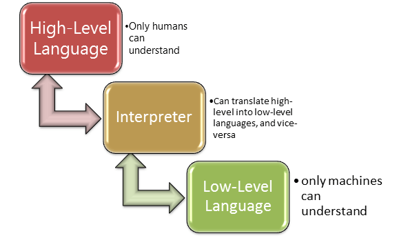

**1_基础概念及环境部署**

---

[TOC]

---

# 1. 编程基础
&emsp;&emsp;用任何编程语言来开发程序，都是为了让计算机干活，而计算机干活的 CPU 只认识机器指令，所以，尽管不同的编程语言差异极大，最后都得 `翻译` 成 CPU 可以执行的机器指令。而不同的编程语言，干同一个活，编写的代码量，差距也很大。  
&emsp;&emsp;比如，完成同一个任务，可能 C 语言要写 1000 行代码，Java 需要写 100 行，而 Python 却只要 10 行。  
&emsp;&emsp;所以 Python 是一种高级语言。  
&emsp;&emsp;那是不是越低级的程序越难学，越高级的程序越简单？表面上来说，是的，但是，在非常高的抽象计算中，高级的 Python 程序设计也是非常难学的，所以，高级程序语言不等于简单。即便如此，对于初学者和完成普通任务，Python 语言还是非常简单易用的。连 Google 都在大规模使用 Python，别担心学了会没用。  


## 1.1. 基本概念
&emsp;&emsp;程序：是一组能让计算机识别和执行的指令。    
&emsp;&emsp;计算机五大部件：`输入设备`、`输出设备`、`运算器`、`控制器`、`存储器`，各部件的主要作用：

- __运算器__：完成各种算数运算、逻辑运算、数据传输等数据加工处理
- __控制器__：控制程序的执行
- __存储器__：用于记忆程序和数据，例如内存
- __输入设备__：将数据或者程序输入到计算机中，例如鼠标、键盘
- __输出设备__：将数据或程序的处理结果展示给用户，例如显示器、打印机等    

> &emsp;&emsp;CPU 由运算器和控制器组成，其中还有寄存器以及多级缓存，其中我们所熟知的 L1、L2 缓存是每个 CPU 核心独占的，而 L3 缓存则是所有核心共享的。寄存器、多级缓存、内存、硬盘的读取速度依次降低。  

&emsp;&emsp;`计算机语言`: 人与计算机之间交互的语言，机器语言、汇编语言等属于早期语言的代表，机器语言由一定位数组成的二进制 0 和 1 的序列组成，这种语言非常晦涩，难以理解，难以记录，而汇编语言则借助了一些助记符来替代机器指令，虽然好记了一点，但还是难以学习，后来经过时代的变迁，牛人们的不断贡献，慢慢的针对不同场景的编程语言逐渐出现、百花齐放。


## 1.2. 语言分类
&emsp;&emsp;从距离机器和人类可读的两种方向，主要分为 `低级语言` 和 `高级语言`。  
- __低级语言__：面向的机器的语言，比如机器语言、汇编语言，不同的机器不能通用。
- __高级语言__：接近人类可读的自然和数字结合的计算机语言，由编译程序转换成机器指令来进行执行，我们只需要关注如何书写源程序，剩下编译的事情就交给编译器进行处理。

&emsp;&emsp;从运行方式来看又分为 `编译型语言` 和 `解释型语言`。  
- __编译语言__：把代码转换成目标机器的 CPU 指令
- __解释语言__：解释后转换成字节码，运行在虚拟机上，解释器执行中间代码  

&emsp;&emsp;语言越高级，越接近人类的自然语言和数学语言，越低级则越能让机器理解，高级语言和低级语言之间需要的一个转换的工具：编译器、解释器，例如 C、C++ 等语言的源代码需要本地编译，而 Java、Python、C# 的源代码需要被解释器编译成中间代码，在虚拟机上运行。  

  


## 1.3. 高级语言的发展
&emsp;&emsp;高级语言根据发展历程主要分为四个阶段或者说是四种类型：`非结构化`、`结构化`、`面向对象`、`函数式`：
- `非结构化语言`：编号或标签、GOTO、子程序可以有多个入口和出口，有分支、循环。
- `结构化语言`：任何基本语句只允许是唯一入口和出口，有顺序、分支、循环、废弃 GOTO
- `面向对象的语言`：更加接近人类认知世界的方式，万事万物抽象成对象，对象间关系抽象成类和继承。而类具有封装、继承、多态等特性
- `函数式语言`：属于一种古老的编程范式，应用在数据计算、并行处理等场景，在这种语言中，函数是 ' 一等公民 '，利用函数的特性，还有更高级的比如高阶函数等。


# 2. 程序
&emsp;&emsp;__程序 = 算法 + 数据结构__。`程序` 有如下特点：
1. 数据是一切程序的核心
1. 数据结构是数据在计算机中的类型和组织方式
1. 算法是处理数据的方式，算法有优劣之分  

&emsp;&emsp;__写程序难点:__  
1. 理不清数据
1. 搞不清处理方法
1. 无法把数据设计转换成数据结构，无法把处理方法转换成算法
1. 无法用设计范式来进行程序设计
1. 世间程序皆有 bug，但不会 debug


# 3. Python 的语言介绍
&emsp;&emsp;Python 是著名的 “龟叔” Guido van Rossum 在 1989 年圣诞节期间，为了打发无聊的圣诞节而编写的一门编程语言。  
&emsp;&emsp;Python 作为一门高级编程语言，相比于其他语言，初学者很容易入门，除此之外，Python 还具有以下优点：  

1. __简单__：Python 奉行简洁主义，易于读写，它使你能够专注于解决问题而不是去搞明白语言本身。
1. __兼容性__：Python 兼容众多平台，所以开发者不会遇到使用其他语言时常会遇到的困扰。
1. __面向对象__：Python 既支持面向过程，也支持面向对象编程。在面向过程编程中，程序员复用代码，在面向对象编程中，使用基于数据和函数的对象。
1. __丰富的库__：Python 标准库确实很庞大。它可以帮助你处理各种工作，包括正则表达式、文档生成、单元测试、线程、数据库、网页浏览器、CGI、FTP、电子邮件、XML、XML-RPC、HTML、WAV 文件、密码系统、GUI (图形用户界面)、Tk 和其他与系统有关的操作。
1. __规范的代码__：Python 采用强制缩进的方式使得代码具有极佳的可读性。
1. __可扩展性和可嵌入性__。如果你需要你的一段关键代码运行得更快或者希望某些算法不公开，你可以把你的部分程序用 C 或 C++ 编写，然后在你的 Python 程序中使用它们。你可以把 Python 嵌入你的 C/C++ 程序，从而向你的程序用户提供脚本功能。

> &emsp;&emsp;Python 的学习强度相对于其他的一些编程语言普遍公认更简单，零基础也可轻松学会，而且发展前景好，在人工智能、大数据、云计算、运维自动化等领域均得到了广泛的应用，且现阶段人才紧缺，薪资普遍高于其他编程语言，因此，是 IT 转型的好选择！  

&emsp;&emsp;此外 Python 还是一种 `动态编译的、强类型的` 语言，那么什么是动态编译语言，什么是强类型语言呢？  
- __静态编译语言__：实现声明变量类型，类型不能再改变，编译时检查，如 C、C++、Java
- __动态编译语言__：不用事先声明类型，随时可以赋值为其他类型，但编程时不知道是什么类型，很难推断，如 Python、PHP、JavaScript
- __强类型语言__：不同类型之间操作，必须先强制类型转换为同一类型，比如 `print('a'+1)`, 将字符串和数字直接相加将抛出异常，无法正常执行，如 Python、Java
- __弱类型语言__：不同类型间可以操作，自动隐式转换，比如 JavaScript 中 `Console.log(1+'a')`  

![program_language_type]../Photo/program_language_type.png)


# 4. Python 的解释器
&emsp;&emsp;Python 这种高级语言需要编译成字节码然后由 Python 虚拟机(解释器) 去执行，针对解释器，有多种不同的版本。  
- __官方的 CPython__：C 语言开发，最广泛的 Python 解释器
- __IPython__：一个交互式、功能增强的 CPython，其典型应用是 jupyter notebook，常用于学习 Python、数据分析、机器学习等领域
- __PyPy__：Python 语言写的 Python 解释器，并且针对性的进行了优化，比如 JIT 技术，动态编译 Python 代码
- __JPython__：Python 的源码编译成 Java 的字节码，跑在 JVM 上
- __IronPython__：与 Jython 类似，运行在.Net 平台上的解释器，Python 代码被编译成.Net 的字节码  

> &emsp;&emsp; 虽然列举了这么多编译器，但是目前主流的还是官方提供的 CPython，但 PyPy 由于使用 Python 语言编写，针对性的进行了许多优化，据说速度可以达到 CPython 的 5 倍以上，建议后期可以研究一下  


# 5. Python 版本区别
&emsp;&emsp;Python 是很多 Linux 系统默认安装的语言，以 CentOS 为例由于其 yum 包管理工具使用的是 Python 开发，所以其内置了 Python 2.x 版本，但是 Python 目前已经发展到了 3.7 版本了，并且 Python 官方对 2.x 的支持也快到期，所以建议学习 Python 的 3.x 版本。  
&emsp;&emsp;Python 3.x 的在本质上和 Python 2.x 有很大的变化，2.x 的程序是不能直接在 3.x 的版本上运行的，它们的主要区别有：

- __语句函数化__。例如 `print(1,2)` 打印出 1 2，但是 2.x 中意思是 `print` 语句打印元组，3.x 中意思是函数的 2 个参数
- __整除__。在 3.x 中，/ 为自然除，// 为整除。2.x 中 / 和 // 都为整除。
- __`input` 函数__。3.x 中把 2.x 中的 `raw_input` 舍去，功能合并到 `input` 函数中去。
- __`round` 函数__。在 3.x 中的取整变为距离最近的偶数
- __3.x 字符串统一使用 unicode__。2.x 中如果想要输入中文，还需要在文件头显式声明 (`_*_coding:utf-8 _*_`)
- __异常的捕获、抛出的语法改变__  


# 6. Python 安装
&emsp;&emsp;不同平台需要安装不同版本的 Python，比如 windows，需要用 exe 应用程序，而 Linux 可以下载源码编译安装，或者 yum 安装。


## 6.1. windows 安装
&emsp;&emsp;__安装方法__：由于 windows 是图形界面，这里就不一一截图了，只文字说明安装步骤。

1. __下载安装包__  
访问 [https://www.Python.org/](https://www.Python.org/) 在 Downloads 标签页下选择 windows，然后根据自己需求，下载对应的 `Windows x86-64 executable installer` 版本

2. __安装__  
&emsp;&emsp;双击下载好的 `Windows x86-64 executable installer`，一直 next 即可。   
> &emsp;&emsp;安装路径默认即可，不要自作聪明修改

3. __配置环境变量__  
&emsp;&emsp;在安装程序中选择 add to PATH，就是把 Python 命令安装在 PATH 变量中，让我们可以在任意地方通过命令访问，如果忘记选择，也可以通过下面的方法进行设置：  
&emsp;&emsp;右击我的电脑 --> 属性 --> 高级系统设置 --> 环境变量 --> 编辑 PATH 变量 --> 添加 Python 的安装路径 C:\Python36 （以分号 `;` 隔开）--> 确定  

4. __测试__  
&emsp;&emsp;打开 cmd (命令提示符，快捷键 windows+r) ，输入 Python ，可以进入解释器表示安装成功  

-
## 6.2. Linux 安装
&emsp;&emsp;Linux 的安装有 yum 和编译安装两种方式：
1. yum 方式  

```bash
[root@centos7 ~]# yum install -y Python36
```

2. 编译安装  
&emsp;&emsp;编译安装稍微麻烦一些，详细操作步骤请参考我的另一篇博客《CentOS 7 系统编译安装 Python 3 环境》：[https://blog.csdn.net/colinlee19860724/article/details/88856657](https://blog.csdn.net/colinlee19860724/article/details/88856657)


# 7. pyenv 多版本管理
&emsp;&emsp;在实际工作情况下，由于每个项目用的可能不是一个版本的 Python，并且不同应用程序所以来的第三方程序包都不同，如何让多版本 Python 进行共存，并且保证每个项目依赖的第三方包。想要让多个 Python 版本共存，有如下两种方法：
- 编译安装新版本至某一个路径
- 多版本 Python 管理工具  

> &emsp;&emsp;如果每添加一个新的 Python 版本就编译一次的话，大大增加了环境切换的成本，并且还需要区分命令(Python3.5, Python 2.7) 等等，所以就凸显出了多版本管理工具的优点


## 7.1. pyenv 介绍及安装
&emsp;&emsp;pyenv 是一个多版本 Python 管理工具，它可以帮我们安装想要的 Python 版本，并且可以一键切换。pyenv 是一个开源的项目，其代码托管在 github 上，我们可以访问它的 github 站点来根据 install 的步骤进行安装。pyenv 的 github 地址：[https://github.com/pyenv/pyenv](https://github.com/pyenv/pyenv)，使用此方法的详细安装说明还可以参考我的另一篇博客《CentOS 7 系统下使用 Pyenv 安装 Python 环境》：[https://blog.csdn.net/colinlee19860724/article/details/89095650](https://blog.csdn.net/colinlee19860724/article/details/89095650)  
&emsp;&emsp;pyenv 官方还提供了便捷的安装方式，它的项目地址是：[https://github.com/pyenv/pyenv-installer](https://github.com/pyenv/pyenv-installer)，仅需要简单几步就可以完成安装，下面以这种方式进行说明。  

&emsp;&emsp;__下面的步骤已在 CentOS 7.6 上测试，并安装成功：__  
1. 安装依赖包 (由于 pyenv 默认使用编译的方式安装 Python，所以它需要的依赖包需要提前安装)

```bash
[root@centos7 ~]# yum install -y gcc make patch gdbm-devel openssl-devel sqlite-devel readline-devel zlib-devel bzip2-devel
```

2. 安装 GIT (由于 pyenv-installer 中调用 git 使用 clone 的方式拉取 pyenv 的代码，所以这里需要进行安装)

```bash
[root@centos7 ~]# yum install -y git
```

3. 安装 Pyenv

```bash
# 执行如下命令安装 pyenv
[root@centos7 ~]# curl -L https://github.com/pyenv/pyenv-installer/raw/master/bin/pyenv-installer | bash
```

4. 修改环境变量

```bash
[root@centos7 ~]# vim /etc/profile.d/pyenv.sh
[root@centos7 ~]# cat /etc/profile.d/pyenv.sh
#!/bin/bash
# Define environment variable
export PYENV_ROOT="$HOME/.pyenv"
export PATH="$PYENV_ROOT/bin:$PATH"
eval "$(pyenv init -)"
  
[root@centos7 ~]# source /etc/profile.d/pyenv.sh
# PS：这里直接更新了 /etc/profile.d，如果是单个用户安装并使用，建议添加到用户家目录中的 profile 文件中去
```

5. 验证

```bash
[root@centos7 ~]# pyenv version
system (set by /root/.pyenv/version)  # 表示当前使用的是系统的 Python 版本
```

6. pyenv 命令

```bash
pyenv -h                # 即可列出命令帮助信息
pyenv install -l        # 列出安装的版本信息
pyenv install 3.6.6     # 安装 3.6.6 版本
pyenv versions          # 查看系统 Python 版本（pyenv install 安装的版本都可以在这里看到）
pyenv global 3.6.6      # 切换 Python 默认版本为 3.6.6
pyenv local 3.6.6       # 切换当前目录下的 Python 版本为 3.6.6 (和目录绑定，子目录继承环境设定)
pyenv shell 3.6.6       # 仅仅针对当前 shell 环境 (会话级别)
```

7. 离线安装 Python 版本  

&emsp;&emsp;通过 `pyenv install 3.6.6` 进行安装时，它会联网下载 `Python 3.6.6` 的源码包，如果机器不能上网的话，可以采用离线的方式，预先下载好 Python 要安装的 Python 的版本包（注意需要 `gz,xz,bz`，三种格式都需要) 在 pyenv 的安装目录下，一般在用户的家目录下 `.pyenv` 目录中，进入后新建子目录 cache，然后把三个包考进去即可，然后再次执行 `pyenv install 3.6.6` 即可

```bash
[root@centos7 ~]# cd .pyenv
[root@centos7 ~]# mkdir cache
[root@centos7 ~]# rz                   # 通过仿真终端上传三个下载好的 Python 包
[root@centos7 ~]# pyenv install 3.6.6
```


## 7.2. virtualenv
&emsp;&emsp;当多个项目公用一台主机的时候，就会产生很多问题，当你的项目和其他人的项目共用 Python 3.6.6 时，假如每个项目都安装了很多依赖包，你如何区分哪些包是你的项目需要的？这时 virtualenv 就很重要了，它可以在 pyenv 的环境中，再造一个虚拟环境，这个环境是基于 pyenv 中管理的某个主环境，派生出来的独立子环境，你对 virtualenv 进行的操作，和其他的 virtualenv 没有任何关联。

```bash
 # 创建一个 virtualenv 环境，名字为 colin，基于 pyenv 管理的 3.6.6 版本
[root@centos7 ~]# pyenv virtualenv 3.6.6 colin     
[root@centos7 ~]# pyenv versions
* system (set by /root/.pyenv/version)
  3.6.6
  3.6.6/envs/colin
  colin
[root@centos7 ~]# mkdir lxl_test
[root@centos7 ~]# cd lxl_test
[root@centos7 lxl_test]# pyenv local colin
[root@centos7 lxl_test]# pyenv versions
  system
  3.6.6
  3.6.6/envs/colin
* colin (set by /root/lxl_test/.python-version)   # 该目录 virtualenv 环境已切换，这样我们就可以放心的安装和下载依赖包了
```


## 7.3. pyenv 安装位置　
&emsp;&emsp;virtualenv 创建的虚拟环境都存放在 `.pyenv` 安装目录的 `versions` 下：

```bash
[root@centos7 versions]# pwd
/root/.pyenv/versions
[root@centos7 versions]# ll
total 0
drwxr-xr-x. 7 root root 68 Apr  1 15:17 3.6.6
lrwxrwxrwx. 1 root root 38 Apr  1 15:17 colin -> /root/.pyenv/versions/3.6.6/envs/colin
```

&emsp;&emsp; 而你在`virtualenv`中安装的包，则存放在`virtualenv`环境中对应的`site-packages`目录下

```bash
[root@centos7 site-packages]# pwd
/root/.pyenv/versions/3.6.6/envs/colin/lib/python3.6/site-packages
[root@centos7 site-packages]# ls
attr                                pangu-4.0.6.1.dist-info
attrs-19.1.0.dist-info              pangu.py
ipykernel                           prompt_toolkit-2.0.9.dist-info
ipykernel-5.1.0.dist-info           ptyprocess
ipykernel_launcher.py               ptyprocess-0.6.0.dist-info
IPython                             pvectorc.cpython-36m-x86_64-linux-gnu.so
ipython-7.4.0.dist-info             __pycache__
ipython_genutils                    pygments
ipython_genutils-0.2.0.dist-info    Pygments-2.3.1.dist-info
ipywidgets                          pyrsistent
ipywidgets-7.4.2.dist-info          pyrsistent-0.14.11-py3.6.egg-info
```

## 7.4. 导出项目依赖包
&emsp;&emsp;如果某一天我要导出我当前环境安装的所有依赖包，该怎么办呢？Python 已经提供了一个工具，供我们导出当前 Python 版本安装的所有依赖包及名称，它就是 pip 命令 (Python 3.x 中已经内置该命令), 使用它的 `freeze` 参数即可。

```bash
# 使用 freeze 可以直接导出当前安装的依赖包以及
[root@centos7 lxl_test]# pip freeze > requirement.txt    # 对应的版本
[root@centos7 lxl_test]# cat requirement.txt
pangu==4.0.6.1
```

> &emsp;&emsp;注意：在新的项目中，只需要使用` pip install -r requirement.txt` 即可，让 pip 按照 requirement.txt 文件中标识的包和版本进行安装了。pip 命令还有很多强大的功能，下面我们来做个简要介绍。  


# 8. pip 命令
&emsp;&emsp;pip 命令对应 Python 来说，就像 Yum 和 CentOS 的关系，它是 Python 的包管理工具，我们可以使用 pip 命令安装几乎所有的 Python 第三方包。


## 8.1. 命令说明

```bash
[root@centos7 lxl_test]# pip -h

Usage:   
  pip <command> [options]

Commands:
  install                    # 安装第三方包
  download                   # 下载第三方包
  uninstall                  # 卸载第三方包
  freeze                     # 输出包的名称和版本信息，可以重定向到文件中去
  list                       # 显示已安装的第三方包
  show                       # 显示安装包信息
  search                     # 在 Pypi 库中查找第三方包
  help                       # 查看帮助信息

General Options:
  -h, --help                 # 显示帮助
  -v, --verbose              # 显示详细信息
  -V, --version              # 显示版本信息
  -q, --quiet                # 安静模式，不输出任何提示信息
  --log <path>               # 把输出信息追加 log 文件中
  --proxy <proxy>            # 使用代理，格式为： [user:passwd@] proxy.server:port.
  --retries <retries>        # 最大连接失败重试次数，默认 5 次
  --timeout <sec>            # 设置最大超时时间，默认是 15 秒
  --cache-dir <dir>          # 指定缓存目录
  --no-cache-dir             # 禁用缓存
```

## 8.2. 配置说明
&emsp;&emsp;pip 命名默认是从 Python 官方提供的 Pypi 仓库进行第三方软件包，由于官方源在国外，访问速度可能会很慢，我们可以把 Pypi 源换成国内的阿里源，来增加访问速度。 配置起来也很简单，只需要新增 pip 的配置文件，指定源为阿里源即可。  
&emsp;&emsp;__创建 pip 配置文件：__

```bash
[root@centos7 ~]# mkdir ~/.pip
[root@centos7 ~]# cd .pip
[root@centos7 .pip]# vim pip.conf 
[root@centos7 .pip]# cat pip.conf
[global]                                           # 全局配置段
index-url=https://mirrors.aliyun.com/pypi/simple/  # pypi 仓库地址
trusted-host=mirrors.aliyun.com                    # 信任主机
```


# 9. Pycharm 安装及基本使用
&emsp;&emsp;PyCharm 是一种 Python IDE，带有一整套可以帮助用户在使用 Python 语言开发时提高其效率的工具，比如调试、语法高亮、Project 管理、代码跳转、智能提示、自动完成、单元测试、版本控制。此外，该 IDE 提供了一些高级功能，以用于支持 Django 框架下的专业 Web 开发。  
&emsp;&emsp;__一句话总结__：帮助我们将代码自动格式化（优雅的空格），关键字提示，以及一键执行、调试等功能，对于敏捷开发有很大的帮助。所以 Pythoner 请使用 Pycharm 吧。  
&emsp;&emsp;具体安装方法这里不再赘述，请大家自行上网搜索，安装过程中遇到的问题，欢迎邮件咨询 517999276@qq.com 。


# 10. 第一个 Python 程序
&emsp;&emsp;Python 语言已经安装完毕，环境也已经配置好，那我们就来写一个简单的 Python 程序吧  
&emsp;&emsp;例子如下：  

```bash
# Python 2.x
print 'hello world'
 
# Python 3.x
print('hello world')

# 这里：引号内的是要打印到屏幕上的字符，快去试试吧。
```